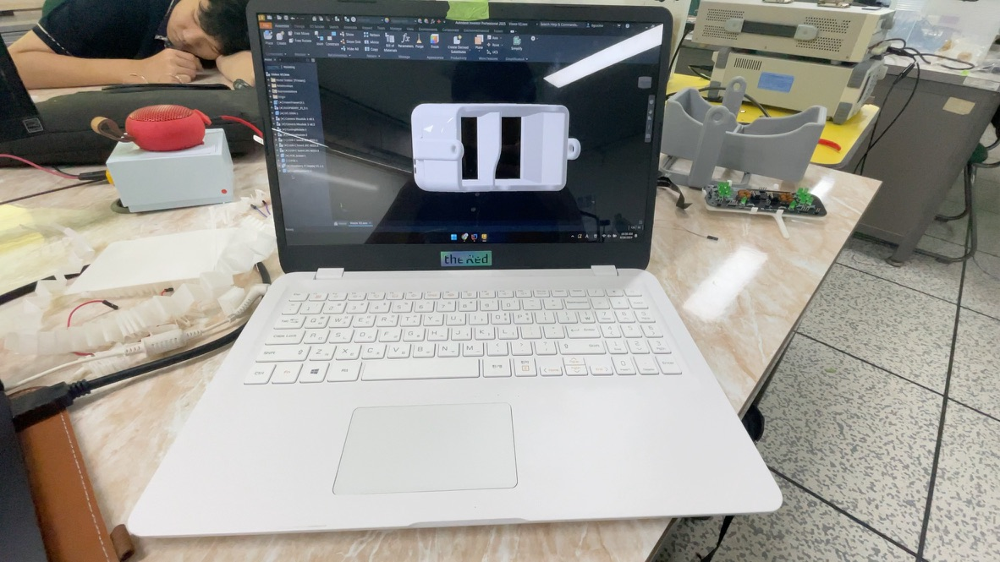
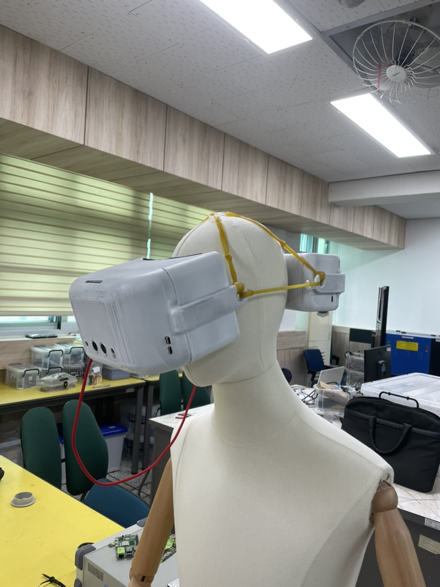

[//]: # (my description md file)

# BL™ v1
> Blind Lumos  
>devMaxTrauma. Inc.™ presents BL™ v1

## 목차
> 1. [소개](#소개)
> 2. [대상 및 목적](#대상-및-목적)
> 3. [오픈소스](#오픈소스)
> 4. [기능](#기능)
> 5. [개발 과정](#개발-과정)
> 6. [알려진 문제](#알려진-문제)
> 7. [개발자들](#개발자들)

## 대상 및 목적
- 사람들은 보통 시각장애인이라 하면 전맹일 것이라 생각하지만, 실제로는 전체 시각장애인 중 약 12%만이 전맹이고, 나머지 88%는 색약이 있거나 시력이 떨어지는 사람들입니다. [출처](http://www.kbufac.or.kr/Board/News/Detail?ContentSeq=2908&Page=19)
- BL™은 전맹이 아닌 시각장애인들을 주 대상으로 하며, 시각장애인의 불확실한 시각정보를 보완해주기 위해 제작한 작품입니다.

## 오픈소스

> EULA:
> 
> BL™ v1 을 개발하는데 사용된 각종 소프트웨어 코드들은 모두 오픈소스로 제작되었습니다. 이는 어느 누구든지 이 프로젝트를 참고하거나 코드를 자유롭게 수정할 수 있음을 의미합니다.
> 
> 다만, 이 프로젝트를 참고하거나 코드를 수정할 때에는 반드시 출처를 밝혀주시기 바랍니다.
> 
> 출처를 밝히지 않거나 비도덕적인 목적을 위하여 해당 프로잭트가 악용되는 경우, 귀하가 작성한 코드는 devMaxTrauma. Inc. 및 개발자들이 소유권을 행사할 수 있습니다.
> 
> 이 프로젝트에 참여하는 것 만으로도 동의로 간주됩니다.

### Software
- [S:IDE™](https://github.com/ellystargram/SIDE) - 자체개발 Python 위주의 IDE
- [rOS™](https://github.com/ellystargram/rOS) - Raspberry Pi 에서 돌아가는 텐서플로우 운영 체제

### OneDrive
- [devMaxTrauma](https://1drv.ms/f/s!AoxgIdA9pSOjgcc-bGrW2MrLag1mlA?e=bQdmH5) - 모든 프로젝트파일이 있는 클라우드. 원천.

## 기능

> BL™ v1은 시각장애인의 시각정보를 보완해주는 제품입니다.

- BL™ v1은 라즈베리파이와 텐서플로우를 이용하여 사물을 인식하고, OpenCV를 이용하여 사물을 강조하여 표시합니다.
- SLD와 연동되어 안드로이드 기기에서 FindMy 기능을 사용할 수 있습니다.
- 탭틱엔진을 이용하여 햅틱 피드백을 얻을 수 있습니다.
- AR 기기답게 FPS 증진에 초점을 맞추어 최적화되었습니다. OpenCV Thread 와 Tensorflow Thread 를 병렬로 돌리며, 이를 통해 빠른 인식을 제공합니다.
- 물체와 사용자간의 거리를 측정하여 사용자에게 알려줍니다.

## 개발 과정

### 설계 단계때 Inventor 상에 설계된 모델

### 착용샷

### PCB

## 알려진 문제
- BL™ v1은 보기와 다르게 무거울 수 있습니다. 이는 MVP제품 특성상 발생하는 문제로, 이후 출시될 제품에서 개선될 예정입니다.
- BL™ v1은 시각장애인의 시각정보를 보완해주는 제품이지만, 시각장애인의 시각정보를 완벽하게 보완해주지는 못합니다. 이 점을 감안하여 사용해주시기 바랍니다.
- BL™ v1의 현재 디스플레이는 라즈베리파이 7인치 디스플레이로, 해상도가 낮고 명암비가 충분하지 않을 수 있습니다. 이는 다음 세대 제품에서 OLED 디스플레이를 탑제하면서 해결될 문제입니다.
- Light Seal™ 은 사람 체형에 맞춰서 커스텀으로 제작됩니다. 현제 착용하신 Light Seal 은 조원들중 한명의 얼굴을 본따 만들었기에 불편할 수 있습니다.
- Tensorflow Lite 모델이 부정확한 결과를 가져올 수 있습니다. 이는 AR 제품 특성상 FPS를 높이기 위해 모델을 최적화하다 보니 발생하는 문제입니다. 이는 다음 세대 제품에서 개선되길 희망합니다.

## 개발자들
### 최지오
> Role: Techno_King && Software Integrating Maestro
- 
- 

### 송다연
>Role: Circuit Master
- 

### 최지훈
>Role: QC Master && Android Platform Sailor
- 

[//]: # (![BL™ v1]&#40;./BLv1.jpeg&#41;)

[//]: # (# ellystargram)

[//]: # (> print&#40;"Hello, developers!"&#41;  # in Python)

[//]: # (> )

[//]: # (> println&#40;"Hello, developers!"&#41;  // in Kotlin)

[//]: # (> )

[//]: # (> printf&#40;"Hello, developers!\n"&#41;;  // in C)

[//]: # (> )

[//]: # (> print&#40;"Hello, developers!"&#41;  // in Swift)

[//]: # (>)

[//]: # (> System.out.println&#40;"Hello, developers!"&#41;;  // in Java)

[//]: # ()
[//]: # (## 📚 Index)

[//]: # (- [Introduction]&#40;#-introduction&#41;)

[//]: # (- [Features]&#40;#-features&#41;)

[//]: # ()
[//]: # (## 📚 Introduction)

[//]: # (- I'm the begining developer who is interested in Python, Kotlin, Java and Swift.)

[//]: # (- I'm a student of Incheon Electronic Meister High School.)

[//]: # (- Contact me:)

[//]: # (    - Email: techno.work@icloud.com)

[//]: # (    - Discord: giochoi)

[//]: # ()
[//]: # (## 📚 Features)

[//]: # (- I'm able to developing with:)

[//]: # (    - Python)

[//]: # (    - Kotlin)

[//]: # (    - Java)

[//]: # (    - Swift)

[//]: # (    - new and object-oriented programming languages)

[//]: # ()
